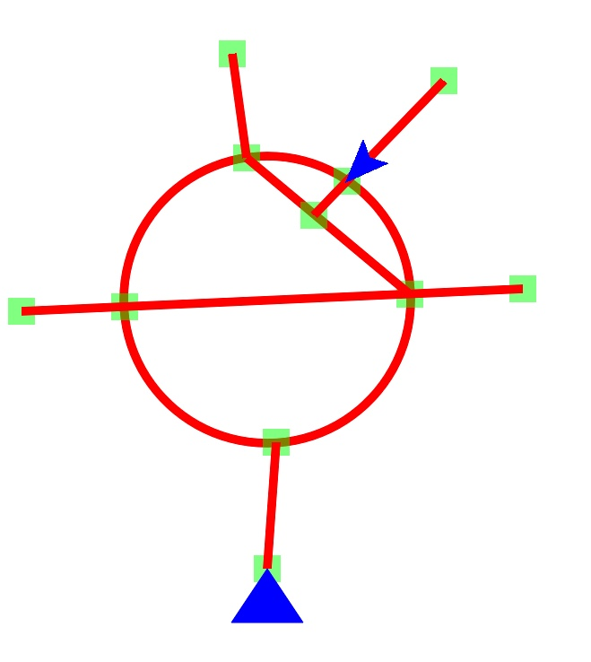

## Streets

**Streets** is a prototype / mechanics demo for a road-management simulator inspired by [Mini Metro](https://dinopoloclub.com/minimetro/).

In the prototype, you can draw striaght roads on the screen. Intersections are automatically identified using **[CGPathIntersection](http://github.com/calda/CGPathIntersection)**. Once a car spawner is connected to your road network, cars will be generated periodically. Cars can drive around the scene, taking a random turn when they reach an intersection.

### Screenshots

     

### CGPathIntersection

Surprisingly, calculating the intersections of two `GGPath`s is not function provided by `CoreGraphics`. Intersections must be computed manually. It's simple to analytically calculate the intersection point of two straight lines, but that does not extend to arbitrarily complicated paths. For example, the Streets prototype also has some support for roundabouts:

    

**[CGPathIntersection](http://github.com/calda/CGPathIntersection)**, created as a part of this project and provided as a standalone framework, provide tools for calculating the intersection of arbitrary `CGPath`s. As far as I can tell, it's the only open source Swift framework that provides this functionality.

